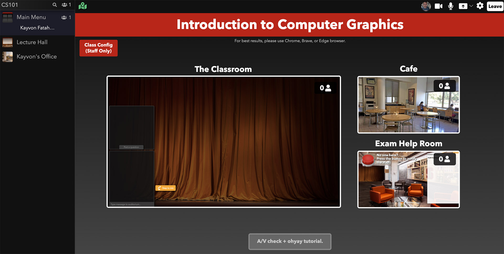

# virtualclassroom

"Kayvon's Virtual Classroom" is an always-on, [ohyay-based](https://ohyay.co) virtual classroom kit that supports synchronous live lecture to up to 500 students (with recording), small student working groups (e.g., for breakouts or flipped classroom settings), and office hours.  The classroom experience is completely customizable, so you can modify the appearance of the UI or extend its functionality to meet your class' needs.  I have used this classroom to teach a number of courses at Stanford since Fall 2020. Please contact me (Kayvon Fatahalian) if you have additional questions.  

__If you want to receive communication about any updates to this tool in the future, please sign up [here](https://forms.gle/A8S8xJNQBtXeFaTZ9).__

## A quick example video of using the lecture hall

Read this [blog post](https://graphics.stanford.edu/~kayvonf/notes/virtualteachingkit/) explaining the basic components, or watch this eight-minute crash course video.

<iframe width="720" height="405" src="https://www.youtube.com/embed/t7uTLH9DON8" title="YouTube video player" frameborder="0" allow="accelerometer; autoplay; clipboard-write; encrypted-media; gyroscope; picture-in-picture" allowfullscreen></iframe>

  
## Getting Started

__Step 1.__ Create yourself a copy of the ohyay classroom, go the [project page](https://ohyay.co/space_gallery?itemId=ws_VQopSi1J) in the ohyay workspace gallery and press the "Explore" button.

__Step 2.__ The classroom is now live! If you enter the site, you'll be on the main page, which links to a number of other rooms, such as your virtual lecture hall.

__Step 3. Go to the class configuration panel.__ If you look in the top left corner of the main menu, you'll see a red button labeled "Class Config" that will take you to the site's configuation pages.  Enter basic information about your course (the course's name, provide a vanity url that you can provide your students and course staff, etc.).  

For example here's me setting up a course called "Introduction to Computer Graphics" and giving the space the URL `https://ohyay.co/s/my-great-course`.  This is the link you will distribute to students and staff.

__Step 4: Create yourself an office.__. Click the "Office Hours" tab in the configuration panel.  Give your office a name, and choose a template for what you'd like your office to look like. Below, I decided to have my office hours in Paris.  Click "Create New Office", and now you have a virtual office!  

__Step 5: Now explore your new virtual classroom.__. That's it! Your classroom is now live!  Notice that links to key rooms, like the main menu, the lecture hall, and now your office appear in the left navigation bar.  Those links will be there for easy navigation at all times.  Now head back to the main menu. Your main menu should look something like this.

## Giving Lectures: Using the Main Lecture Hall

Here's a video demonstrating the basic functionality of the lecture hall.

<iframe width="720" height="405" src="https://www.youtube.com/embed/t7uTLH9DON8" title="YouTube video player" frameborder="0" allow="accelerometer; autoplay; clipboard-write; encrypted-media; gyroscope; picture-in-picture" allowfullscreen></iframe>

## Holding Office Hours: How to Use Your Office 

Here's a video demonstrating the basic functionality of your virtual office, and how you can use the office to conduct virtual office hours. In my courses I typically have each instructor and TA has create their own office.  This allows TAs to customize the look and feel of their office to their personality, and allows multiple virtual office hours to be going on at the same time. 

Watch the tutorial video below for a quick demo:

<iframe width="720" height="405" src="https://www.youtube.com/embed/HoCbsnVO_f4" title="YouTube video player" frameborder="0" allow="accelerometer; autoplay; clipboard-write; encrypted-media; gyroscope; picture-in-picture" allowfullscreen></iframe>

  
## Securing Your Classroom Space

By default, when you create a new classroom space, access control is off.  Anyone with the URL of the space will be able to access it.  

You can secure your classroom space in a number of ways: 
 * Password-protect the space (like a Zoom call)
 * Use SSO-based sign on from your university (This is how I operate at Stanford)
 * Explicitly provide a "allow list" of email addresses that can access the space. 

You'll need to use the ohyay workspace editor to set your security settings. Please see ohyay's documentation of [security settings here](https://docs.ohyay.co/docs/password).

## FAQ

#### Question 1: Can I record lectures?

Yes.  You can record any room in the space.  Ohyay provides the recorded video as an MP4 that you can upload to regular courseware sites like Canvas or Panopto.  However, there is no support for direct transfer of the video data.  You'll need to download the video file from your ohyay virtual classroom, then upload it to Canvas or Panopto to share with students.

#### Question 2: How many students can be in class at once?

Each instance of an ohyay workspace should be able to support 400-500 active users.

