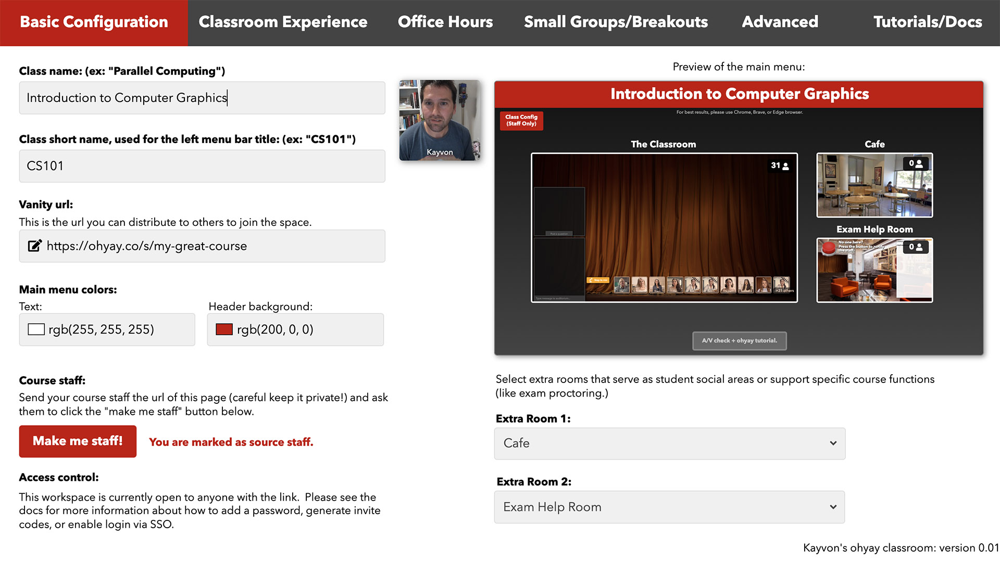
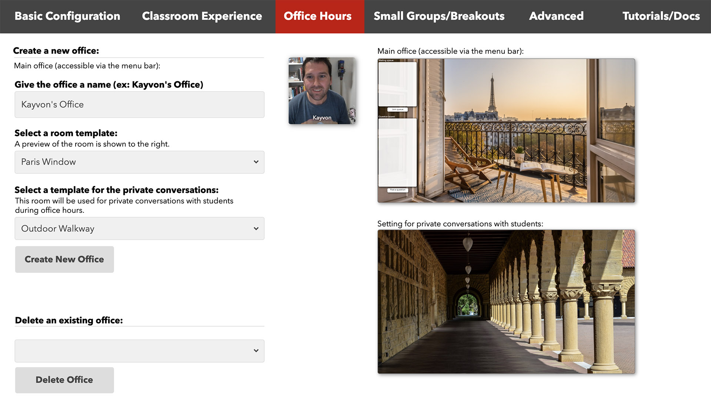

# virtualclassroom

This is a 24-7 "always on" [ohyay-based](https://ohyay.co) virtual classroom that supports synchronous live lecture to up to 500 students, small student working groups (e.g., for breakouts or flipped classroom settings), and office hours.  Please contact me (Kayvon Fatahalian) if you have additional questions.

__If you want to receive communication about any updates to this tool in the future, please sign up [here](https://forms.gle/A8S8xJNQBtXeFaTZ9).__

## Getting Started

__Step 1.__ Create yourself a copy of the ohyay classroom, go the [project page](https://ohyay.co/space_gallery?itemId=ws_VQopSi1J) in the ohyay workspace gallery and press the "Explore" button.

__Step 2.__ The classroom is now live! If you enter the site, you'll be on the main page, which links to a number of other rooms, such as your virtual lecture hall.

__Step 3. Go to the class configuration panel.__ If you look in the top left corner of the main menu, you'll see a red button labeled "Class Config" that will take you to the site's configuation pages.  Enter basic information about your course (the course's name, provide a vanity url that you can provide your students and course staff, etc.).  

For example here's me setting up a course called "Introduction to Computer Graphics" and giving the space the URL `https://ohyay.co/s/my-great-course`.  This is the link you will distribute to students and staff.

__Step 4: Create yourself an office.__. Click the "Office Hours" tab in the configuration panel.  Give your office a name, and choose a template for what you'd like your office to look like. Below, I decided to have my office hours in Paris.  Click "Create New Office", and now you have a virtual office!  

__Step 5: Now explore your new virtual classroom.__. That's it! Your classroom is now live!  Notice that links to key rooms, like the main menu, the lecture hall, and now your office appear in the left navigation bar.  Those links will be there for easy navigation at all times.  Now head back to the main menu. Your main menu should look something like this.

## Using the Auditorium

Coming soon...

## Using your Office

Coming soon...

## Adding additional staff

Coming soon...

