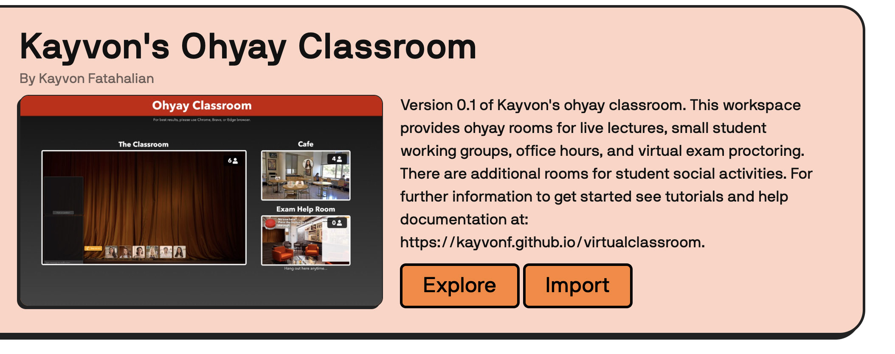

# virtualclassroom

This is a 24-7 "always on" [ohyay-based](https://ohyay.co) virtual classroom that supports synchronous live lecture to up to 500 students, small student working groups (e.g., for breakouts or flipped classroom settings), and office hours.  Please contact me (Kayvon Fatahalian) if you have additional questions.

__If you want to receive communication about any updates to this tool in the future, please sign up [here](https://forms.gle/A8S8xJNQBtXeFaTZ9).__

## A quick example video of using the lecture hall

A crash course in 8 minutes.

## Getting Started

__Step 1.__ Create yourself a copy of the ohyay classroom, go the [project page](https://ohyay.co/space_gallery?itemId=ws_VQopSi1J) in the ohyay workspace gallery and press the "Explore" button.

__Step 2.__ The classroom is now live! If you enter the site, you'll be on the main page, which links to a number of other rooms, such as your virtual lecture hall.

__Step 3. Go to the class configuration panel.__ If you look in the top left corner of the main menu, you'll see a red button labeled "Class Config" that will take you to the site's configuation pages.  Enter basic information about your course (the course's name, provide a vanity url that you can provide your students and course staff, etc.).  

For example here's me setting up a course called "Introduction to Computer Graphics" and giving the space the URL `https://ohyay.co/s/my-great-course`.  This is the link you will distribute to students and staff.

__Step 4: Create yourself an office.__. Click the "Office Hours" tab in the configuration panel.  Give your office a name, and choose a template for what you'd like your office to look like. Below, I decided to have my office hours in Paris.  Click "Create New Office", and now you have a virtual office!  

__Step 5: Now explore your new virtual classroom.__. That's it! Your classroom is now live!  Notice that links to key rooms, like the main menu, the lecture hall, and now your office appear in the left navigation bar.  Those links will be there for easy navigation at all times.  Now head back to the main menu. Your main menu should look something like this.

## Giving Lectures: Using the Main Lecture Hall

For now, please watch [this Youtube video](https://www.youtube.com/watch?v=t7uTLH9DON8).  More information coming soon....

## Holding Office Hours: How to Use Your Office 

By default all offices in the space support screen sharing for all participants (not just staff), contain a waiting list for students to sign up to "get in line" for help, a question board, and the ability to move students to a private version of the office for one-on-one instructor-student communication.  The latter is very useful when a student needs to talk about the specifics of their work out of ear shot of other students sitting in your virtual office.

More docs coming soon...

## Securing Your Classroom Space

By default, when you create a new classroom space, access control is off.  Anyone with the URL of the space will be able to access it.  You can secure your classroom space in a number of ways: password-protect the space (like a Zoom call), use SSO-based sign on from your university (This is how I operate at Stanford), or explicitly provide a "allow list" of email addresses that can access the space. Details coming soon.

